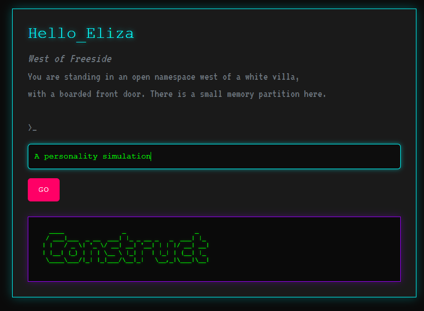

# Hello_Eliza

**A conversational website about hidden systems, manipulation, and consent**

Hello_Eliza is a deliberately constrained conversational website. It responds to text input using pattern matching and simple state—not machine learning—by design.

The project explores how hidden mechanics shape behavior. Intermittent reinforcement drives engagement (and addiction). Conversational interfaces invite trust (and misplaced belief). Systems that obscure how they work can manipulate; systems that expose how they work can teach. **Hello_Eliza uses the same techniques—and then shows you the seams.**

This is not a critique from the outside. ELIZA fooled therapists in 1966 with a lookup table. The same pattern-matching logic powers slot machines, engagement algorithms, and the uncanny valley where correlation is mistaken for understanding. The difference here is not sophistication, but consent.

Inspired by ELIZA, Zork, Myst, and the early web, this repository is both a working web application (ASP.NET Core MVC, vanilla JavaScript) and a self-documenting artifact. Design decisions are annotated in code; when asked, the system explains itself.

Essays will follow on interface design, human-in-the-loop systems, and the gap between *"I don't understand this"* and *"this was built so I wouldn't."*



---

## How It Works

The homepage presents a text input. What happens next depends on state:

| Interaction | Response |
|-------------|----------|
| 1st–2nd input | ASCII art (the surface) |
| 3rd input | "Do you like my art?" — serif, quiet, different |
| 4th+ input | Conversation: pattern matching against a rules table |

Type the right words and you unlock paths—to essays, to external references, to explanations of the system itself. The vocabulary you learn *is* the navigation.

The conversation engine is a JSON rules file. No neural networks, no embeddings, no magic. Just regex, state, and intentional friction.

---

## Tech Stack

| Layer | Technology |
|-------|------------|
| **Backend** | ASP.NET Core 9.0 (MVC) |
| **Frontend** | Razor Views, vanilla JavaScript, HTML5, CSS3 |
| **Conversation Engine** | JSON rules file, regex pattern matching, sessionStorage state |
| **ASCII Rendering** | Custom NuGet package ([Hell0_TDD.Core](https://www.nuget.org/packages/Hell0_TDD.Core)) wrapping Figgle |
| **Content** | Markdown essays with YAML frontmatter, rendered via Markdig |
| **Deployment** | Azure App Service |
| **Testing** | xUnit |

---

## Project Structure

```
Hello_Eliza/
├── Hello_Eliza/
│   ├── Controllers/
│   │   ├── AsciiController.cs      # ASCII art generation
│   │   └── EssayController.cs      # Blog/essay routing
│   ├── Models/
│   │   ├── AsciiInputModel.cs      # Input validation
│   │   └── Essay.cs                # Essay metadata + content
│   ├── Views/
│   │   ├── Ascii/Input.cshtml      # Homepage: input + conversation
│   │   └── Essay/
│   │       ├── Index.cshtml        # Essay list
│   │       └── Detail.cshtml       # Single essay
│   ├── Content/
│   │   └── Essays/                 # Markdown files live here
│   │       └── *.md
│   └── wwwroot/
│       ├── css/
│       │   ├── site.css            # Base styles (cyberpunk)
│       │   └── zork.css            # Conversation-specific styles
│       ├── js/
│       │   └── zork.js             # State machine + conversation engine
│       └── data/
│           └── zork-rules.json     # The rules table (editable, no recompile)
│
├── Hello_Eliza.Tests/
│   └── *.cs                        # Unit tests
│
└── Hello_Eliza.sln
```

---

## Self-Documenting Code

Design decisions are annotated inline using a custom tagging syntax:

```csharp
// >EXAMINE state, why -->
// State lives in sessionStorage because the discovery should be repeatable.
// New browser = new visitor = fresh experience. That's intentional.
// <-- EXAMINE
```

A future crawler will index these annotations. When the system is asked "why does this work this way?" it can answer—with the actual reasoning, from the actual code.

The machine that explains itself is the machine that respects your mind.

---

## Design Notes

**Cyberpunk Aesthetic**

Inspired by William Gibson's *Neuromancer*:
- "Dead channel gray" backgrounds
- Cyan and purple neon with glow effects
- Monospace fonts throughout
- The serif turn: a jarring shift to newspaper typography when the system asks its first real question

**Constraint as Interface**

The limited vocabulary isn't a bug. Forcing users to guess what words work is the point—it mirrors how we probe any unfamiliar system, and rewards curiosity over doom scrolling.

**Intermittent Reinforcement**

Idle timers print ambient messages. Random response selection from arrays. The same mechanics that make slot machines addictive, made visible.

---

## Running Locally

```bash
git clone https://github.com/sooperD00/Hello_Eliza.git
cd Hello_Eliza/Hello_Eliza
dotnet restore
dotnet run
# Navigate to https://localhost:7102
```

### Run tests:

```bash
cd Hello_Eliza.Tests
dotnet test
```

---

## Essays

Essays live in `/Content/Essays/` as Markdown files with YAML frontmatter:

```yaml
---
title: "Your Title"
date: 2026-01-23
description: "Optional subtitle"
published: true
---

Content here...
```

Add a file, restart, it appears. No database, no [CMS](https://en.wikipedia.org/wiki/Content_management_system).

---

## License

MIT License — See [LICENSE](LICENSE) for details.

---

## About

Built by **Nicole Rowsey** — I know exactly what I’m doing, and I chose not to do the obvious thing.

Part of a series: [Hell0_TDD.Core](https://github.com/sooperD00/Hell0_TDD) | [Hell0_Web](https://github.com/sooperD00/Hell0_Web)

**Connect:** [GitHub](https://github.com/sooperD00) | [LinkedIn](https://www.linkedin.com/in/nicole-rowsey)

---

*"A consensual hallucination."* — William Gibson